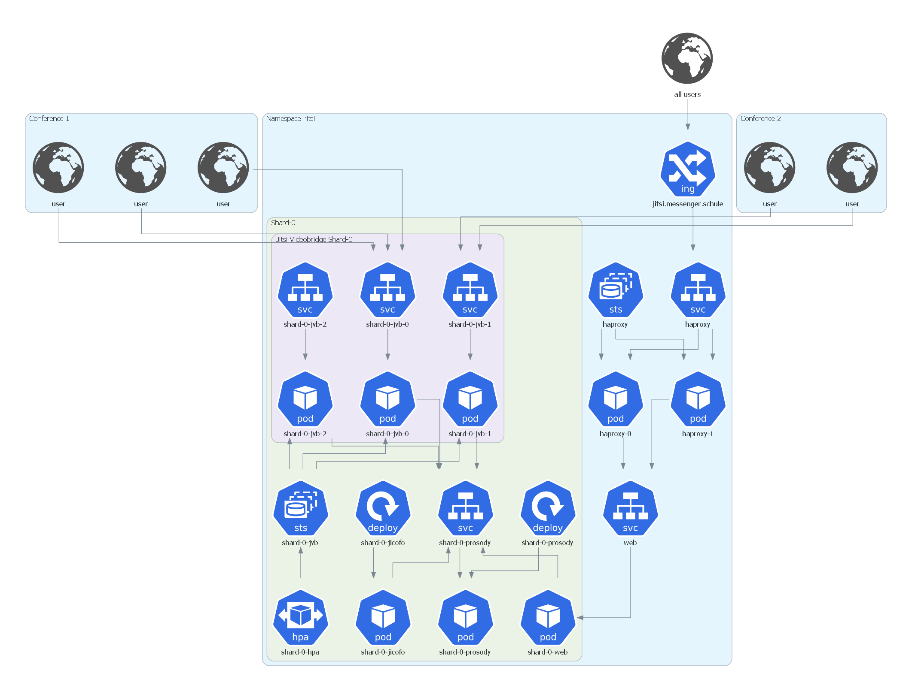

# Jitsi Meet

Scalable video conferencing on Kubernetes.

## Structure

The whole setup is based on Kubernetes YAML files and patches for these files.
It makes use of [kustomize](https://github.com/kubernetes-sigs/kustomize) to customize the raw YAMLs for each environment.

Every directory in the directory tree (depicted below) contains a `kustomize.yaml` file which defines resources (and possibly patches).

```
|-- base
|   |--jitsi
|   |   `-- jvb
|   |--ops
|      |-- cert-manager
|      |-- dashboard
|      |-- ingress-nginx
|      |-- loadbalancer
|      |-- logging
|      |-- metacontroller
|      |-- monitoring
|      `-- reflector
`-- overlays
       |-- development
       |   |--jitsi-base
       |   |--ops
       |   |--shard-0
       |   `--shard-1  
       `-- production
           |--jitsi-base
           |--ops
           |--shard-0
           `--shard-1
```

## Requirements

- [kubectl/v1.17.2+](https://kubernetes.io/docs/tasks/tools/install-kubectl/)
- [kustomize/v3.5.4+](https://github.com/kubernetes-sigs/kustomize/releases/tag/kustomize%2Fv3.5.4)

## Install

To install the full setup go to either [`overlays/development`](overlays/development) or
[`overlays/production`](overlays/production) and run

```bash
$ kustomize build . | kubectl apply -f -
```
It deploys a Jitsi setup consisting of two shards. You can add more shards following the documentation in [docs/architecture/architecture.md](docs/architecture/architecture.md). The setup was tested against a managed Kubernetes cluster (v1.17.2) running on [IONOS Cloud](https://dcd.ionos.com/).

## Architecture

The Jitsi Kubernetes namespace has the following architecture:



A more detailed explanation of the system architecure can be found in [docs/architecture/architecture.md](docs/architecture/architecture.md).

## Load Testing

Terraform scripts can be found that set up multiple servers with an existing image can be found under [`loadtest`](loadtest).
An [init script](loadtest/init.sh) is used to provision the necessary tools to that image. This image also needs SSH
access set up with public key authentication.

After starting a number of load test servers, the load test can be started by using the [run_loadtest.sh](loadtest/run_loadtest.sh) script.
Results can be found in [docs/loadtests/loadtestresults.md](docs/loadtests/loadtestresults.md).
