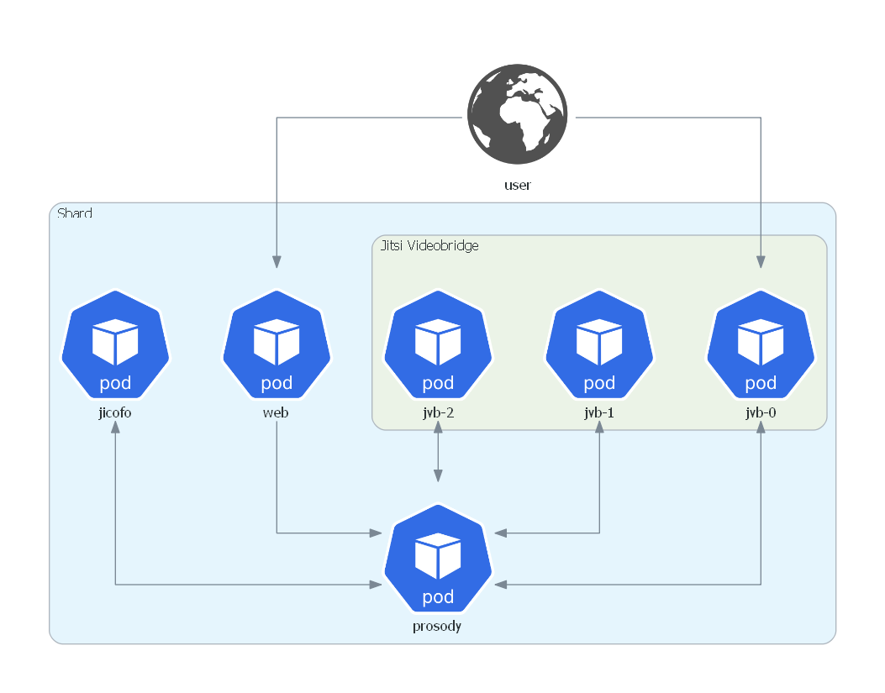
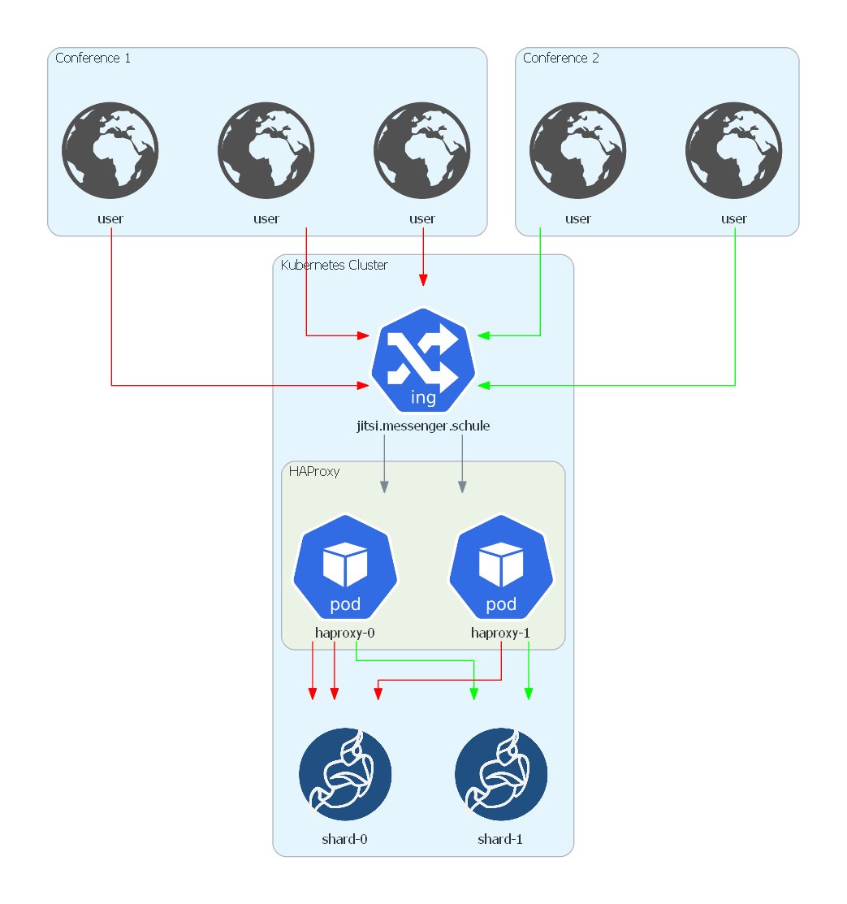

# Architecture

## Jitsi Meet

### Components

A Jitsi Meet installation (holding one "shard", term explained below) consists of the following different components:

1. `web` This container represents the web frontend and is the entrypoint for each user.
2. `jicofo` This component is responsible for managing media sessions between each of the participants and the videobridge.
3. `prosody` This is the XMPP server used for creating the MUCs (multi-user conferences).
4. `jvb` The Jitsi Videobridge is an XMPP server component that allows for multi-user video communication.

Jitsi uses the term "shard" to describe the composition that contains single containers for
`web`, `jicofo`, `prosody` and multiple containers of `jvb` running in parallel. The following diagram
depicts this setup:

In this setup the videobridges can be scaled up and down depending on the current load
(number of video conferences and participants). The videobridge typically is the component with the highest load and
therefore the main part that needs to be scaled.
Nevertheless, the single containers (`web`, `jicofo`, `prosody`) are also prone to running out of resources.
This can be solved by scaling to multiple shards and we will explain this [below](##Shards). More information about this topic can be found in the [Scaling Jitsi Meet in the Cloud Tutorial
](https://www.youtube.com/watch?v=Jj8a6ZRgehI).

### Shards

We allow the setup of several shards. We encounter the following difficulties in that case:

* We need to loadbalance the traffic between the two shards.
* We have to remember on which shard the conferences were allocated, so that participants joining an existing conference later on are routed to the shard, where the conference takes place.

To achieve this, we use the following setup:

Each of the shards have the structure described in the chapter [Components](##Components)

HAProxy is the central component here, as it allows the usage of [stick tables](https://www.haproxy.com/de/blog/introduction-to-haproxy-stick-tables/). We use [them](../../base/ops/loadbalancer/haproxy-configmap.yaml) to save the information, on which shard the conferences take place. HAProxy reads the value of the URL parameter `room` in order to decide, if the conference this participant wants to join already exists (and hence leading her to the correct shard) or if it is a conference which is not known yet in which case simple round-robin-loadbalancing between the shards is applied. In the latter case, HAProxy remembers this new conference and routes all arriving participants of this conference to the correct shard. HAProxy uses DNS service detection for finding the existing shards. The configuration can be found at [haproxy-configmap.yaml](../../base/ops/loadbalancer/haproxy-configmap.yaml). To decrease the risk of failure, we are using a StatefulSet consisting of two HAProxy pods. They are sharing the information on the existing conferences using Kubernetes Services and HAProxy's peering functionality.  

By default, we are using two shards. [Below](##Adding-additional-shards), we will describe on how to add more of them.

### Kubernetes Setup

Making use of the Kubernetes framework the setup looks as follows:

The entrypoint for every user is the ingress that is defined in [jitsi-ingress.yaml](../../base/loadbalancer/haproxy-ingress.yaml)
and patched for each environment by [haproxy-ingress-patch.yaml](../../overlays/production/ops/haproxy-ingress-patch.yaml).
At this point SSL is terminated and traffic is forwarded via HAProxy to the [`web` service](../../base/jitsi/web-service.yaml) in plaintext (port 80)
which in turn exposes the web frontend inside the cluster.

The other containers [jicofo](../../base/jitsi/jicofo-deployment.yaml), [web](../../base/jitsi/web-deployment.yaml) and [prosody](../../base/jitsi/prosody-deployment.yaml), which are necessary for setting up conferences, are each running in a rolling deployment.

When a user starts a conference it is assigned to a videobridge. The video streaming happens directly between the user
and this videobridge. Therefore the videobridges need to be open to the internet. This happens with a service of type `NodePort`
for each videobridge (on a different port).

The videobridges are managed by a [stateful set](../../base/jitsi/jvb/jvb-statefulset.yaml) (to get predictable pod names)
and is patched by each environment with different resource requests/limits.
A [horizontal pod autoscaler](../../base/jitsi/jvb/jvb-hpa.yaml) governs the number of running videobridges based on
the average value of the network traffic transmitted to/from the pods. It is also patched in the overlays to meet the requirements in the corresponding environments.

To achieve the setup of an additional `NodePort` service on a dedicated port per videobridge-pod a
[custom controller](https://metacontroller.app/api/decoratorcontroller/) is used.
This [`service-per-pod` controller](../../base/metacontroller/service-per-pod-configmap.yaml) is triggered by the
creation of a new videobridge pod and sets up the new service binding to a port defined by a base port (30300) plus the
number of the videobridge pod (e.g. 30301 for pod `jvb-1`). A [startup script](../../base/jitsi/jvb/jvb-entrypoint-configmap.yaml)
handles the configuration of the port in use by videobridge. When multiple shards exist, we use the ports 304xx (for the second shard), 305xx (for the third shard) and so on for the videobridges of the additional shards. That means, you can use 100 JVBs per shard at most, which should be sufficient.

In addition, all videobridges communicate with the `prosody` server via a [service](../../base/jitsi/prosody-service.yaml)
of type `ClusterIP`.

## Monitoring

The monitoring stack is comprised of a [kube-prometheus](https://github.com/coreos/kube-prometheus) setup that integrates

* [Prometheus Operator](https://github.com/coreos/prometheus-operator)
* Highly available [Prometheus](https://prometheus.io/)
* Highly available [Alertmanager](https://github.com/prometheus/alertmanager)
* [Prometheus node-exporter](https://github.com/prometheus/node_exporter)
* [Prometheus Adapter for Kubernetes Metrics APIs](https://github.com/DirectXMan12/k8s-prometheus-adapter)
* [kube-state-metrics](https://github.com/kubernetes/kube-state-metrics)
* [Grafana](https://grafana.com/)

This stack is adapted and patched to fit the needs of the Jitsi Meet setup.

The [deployment patch for Grafana](../../base/ops/monitoring/grafana-deployment-patch.yaml) adds a permanent storage to retain
users and changes made in the dashboards. In addition, Grafana is configured to serve from the subpath `/grafana`.
An [ingress](../../base/ops/monitoring/grafana-ingress.yaml) is defined to route traffic to the Grafana instance.
Again, SSL is terminated at the ingress. In order to copy the Kubernetes Secret containing the certificate for your domain from namespace `jitsi` to the `monitoring` namespace, the [kubernetes-reflector](https://github.com/emberstack/kubernetes-reflector) is used.

A role and a role binding to let Prometheus monitor the `jitsi` namespace is defined in
[prometheus-roleBindingSpecificNamespaces.yaml](../../base/ops/monitoring/prometheus-roleBindingSpecificNamespaces.yaml) and
[prometheus-roleSpecificNamespaces.yaml](../../base/ops/monitoring/prometheus-roleSpecificNamespaces.yaml) respectively.

Prometheus also gets adapted by an environment specific [patch](../../overlays/production/ops/prometheus-prometheus-patch.yaml)
that adjusts CPU/memory requests and adds a persistent volume.

Furthermore, [metrics-server](https://github.com/kubernetes-sigs/metrics-server) is used to aggregate resource usage data.

### Videobridge monitoring

The videobridge pods mentioned above have a sidecar container deployed that gathers metrics about the videobridge and
exposes them via a Rest endpoint. This endpoint is scraped by Prometheus based on the definition of a
[PodMonitor](../../base/ops/monitoring/jvb-pod-monitor.yaml) available by the
[Prometheus Operator](https://github.com/coreos/prometheus-operator#customresourcedefinitions). In folder `Default` of Grafana, you will find a dashboard for the current state of your Jitsi-installation.

## Adding additional shards

In order to add an additional shard, follow these steps:

1. In the environment of your choice copy the folder [shard-0](../../overlays/production/shard-0) in the same [folder](../../overlays/production/) and change its name to e.g. `shard-2`.
2. In all those `.yamls`, change every occurence of `shard-0` to `shard-2`, even if `shard-0` can only be found as a substring.
3. In `jvb-statefulset-patch.yaml` in folder `shard-2`, change the argument from `30300` to `30500` (and if you want to add even more shards, change this value to `30600`, `30700`, ... for every additional shard)
4. In [kustomize.yaml](../../overlays/production/kustomization.yaml) add the folder you have added in step 1.
5. Apply your setup as described in chapter "Install" of [README.md](../../README.md).
